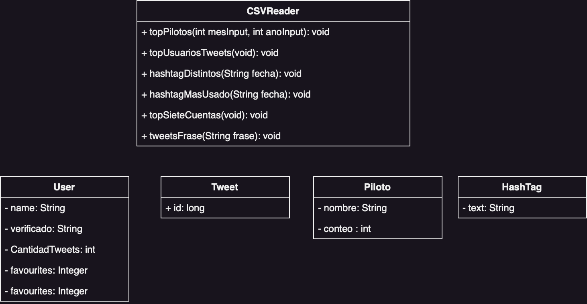

# Informe Obligatorio Progamación2

## Índice

1. [Diagrama UML de Clases](#diagrama-uml-de-clases)
2. [Descripción de los Procesos](#descripción-de-los-procesos)
3. [Medición de Eficiencia de la Aplicación](#medición-de-eficiencia-de-la-aplicación)

## Diagrama UML de Clases

## Descripción de los Procesos

### Carga de Datos

(Aquí debes describir brevemente cómo se realiza la carga de datos en tu aplicación)

### Realización de Reportes

(Aquí debes describir brevemente cómo se generan los reportes en tu aplicación)

## Decisiones Tomadas

En el desarrollo de nuestros procesos, hemos decidido priorizar la eficiencia de la memoria RAM sobre la eficiencia del tiempo. 
Este enfoque prioritario en la eficiencia de la RAM tiene varias ventajas:

1. **Reducción de los costos**: En muchos casos, la memoria RAM puede ser más cara que el tiempo de CPU, por lo que optimizar la utilización de la memoria puede conducir a ahorros significativos.

2. **Estabilidad del sistema**: Un uso ineficiente de la memoria puede causar problemas de estabilidad, como cuelgues o caídas del sistema. Al optimizar el uso de la memoria, podemos mejorar la estabilidad de nuestro sistema y garantizar que nuestros procesos se ejecuten sin interrupciones.

3. **Optimización de la capacidad de procesamiento paralelo**: Con la eficiencia de la memoria como prioridad, estamos mejor preparados para trabajar con procesamiento paralelo, permitiendo a múltiples procesos o hilos ejecutarse simultáneamente sin agotar la memoria.

Entendemos que esta decisión puede tener un impacto en la eficiencia del tiempo. Sin embargo, creemos que las ventajas de optimizar la eficiencia de la memoria superan cualquier desventaja potencial.

## Medición de Eficiencia de la Aplicación

### RAM y Tiempo consumidos:

- Función 1:
    - **Descripción:** Listar los 10 pilotos más mencionados
    - **Memoria RAM consumida:** 70 MB
    - **Tiempo de ejecución promedio:**  10.2s
  

- Función 2:
    - **Descripción:** Top 15 usuarios con más tweets
    - **Memoria RAM consumida:**  97 MB
    - **Tiempo de ejecución promedio:**  7min

- Función 3:
    - **Descripción:** Cantidad de hashtags distintos para un día dado
    - **Memoria RAM consumida:**  65 MB
    - **Tiempo de ejecución promedio:**  6.7ss

- Función 4:
    - **Descripción:** Hashtag más usado para un día dado
    - **Memoria RAM consumida:**  
    - **Tiempo de ejecución promedio:**  

- Función 5:
    - **Descripción:** Top 7 cuentas con más favoritos
    - **Memoria RAM consumida:**  
    - **Tiempo de ejecución promedio:**  

- Función 6:
    - **Descripción:** Cantidad de tweets con una palabra o frase específica
    - **Memoria RAM consumida:**  
    - **Tiempo de ejecución promedio:**  
